# 点云融合原理讲解
##点云的基本格式
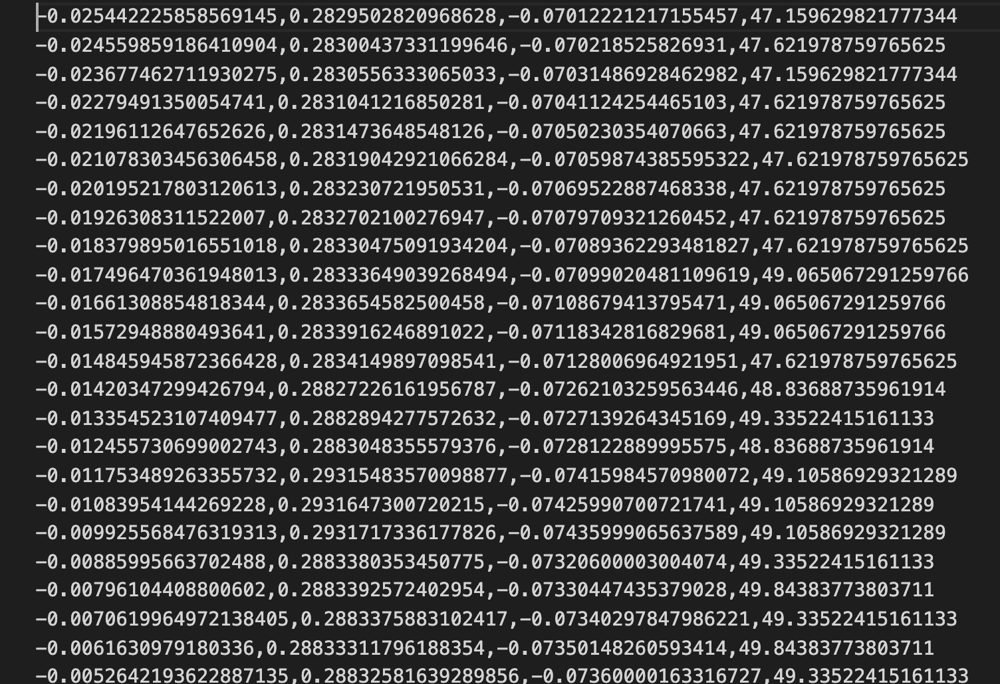

	点云文件无论如何千变万化，核心数据都是x，y，z三个坐标值

##数学基础
1.矩阵运算法则。假如有如下两个矩阵A和B，AB为A和B的矩阵相乘结果，则:
 
 
  

   

	
	矩阵相乘就是左矩阵的每一行和右矩阵的每一列对应相乘再求和。矩阵能相乘的条件就是左矩阵的列数要和右矩阵行数相等。
	
2.三角函数的基本性质:
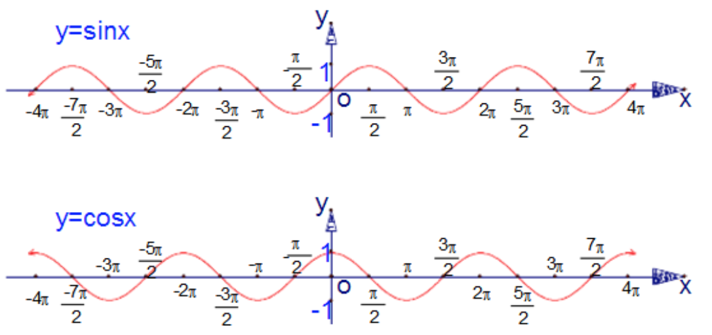   
几个重要的结论：

	sin(α + π/2) = cos(α)
	cos(α + π/2) = -sin(α)
	sin(α - π) = -sin(α)
	cos(α - π) = cos(α)
	sin(α+β)=sin(α)cos(β)+cos(α)sin(β)
	cos(α+β)=cos(α)cos(β)-sin(α)sin(β) 
	
##平移和旋转理论基础
一、仅仅有平移的时候
假设三维空间内存在某个点P1(X1, Y1, Z1)，该点发生平移之后到了P2(X2, Y2, Z2)，在每一个方向上发生的平移分量分别为dx, dy, dz，则容易理解，有以下两个矩阵的关系成立：
A = [X1, Y1, Z1, 1],  B = [X2, Y2, Z2, 1]

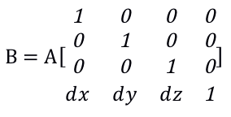   
二、仅仅有旋转的时候
在平面直角坐标系里面，假设有一点A(x, y) 绕原点B逆时针旋转β度，得到C点

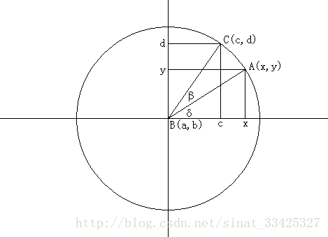   

1.设A点旋转前的角度为δ，则旋转(逆时针)到C点后角度为δ+β  
2.求A，B两点的距离：dist1=|AB|=y/sin(δ)=x/cos(δ)  
3.求C，B两点的距离：dist2=|CB|=d/sin(δ+β)=c/cos(δ+β)  
4.显然dist1=dist2，设dist1=r所以：   

    r=x/cos(δ)=y/sin(δ)=d/sin(δ+β)=c/cos(δ+β) 

5.由三角函数两角和差公式知：

	 sin(δ+β)=sin(δ)cos(β)+cos(δ)sin(β)
	 cos(δ+β)=cos(δ)cos(β)-sin(δ)sin(β) 

所以得出：   

	c=rcos(δ+β)=rcos(δ)cos(β)-rsin(δ)sin(β)=xcos(β)-ysin(β)
   	d=rsin(δ+β)=rsin(δ)cos(β)+rcos(δ)sin(β)=ycos(β)+xsin(β) 
   	
>上述结论的β角是一个大于0度的角， 为了避免欧拉角带来万向锁死锁的问题，需要将旋转角度做约束(β限定在(-pi, pi]区间内)，具体关于万向锁的问题可以参考：https://zhuanlan.zhihu.com/p/346718090

将β限定在(-pi, pi]区间内，根据sin(),cos()的奇偶性，sin(-β)=-sin(β),cos(-β)=cos(β)，则：	

	c=xcos(β)+ysin(β)
	d=ycos(β)-xsin(β)

即：

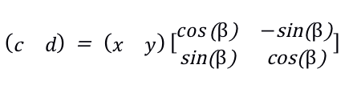   

为了计算方便，我们将上述结果做变形，并将二维平面推广到3维，以及考虑三个轴的旋转问题，得到如下的结论：  
a)平移

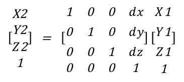  
b) 旋转

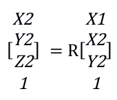   

R矩阵即为旋转矩阵，具体为三个方向的旋转矩阵的乘积：  

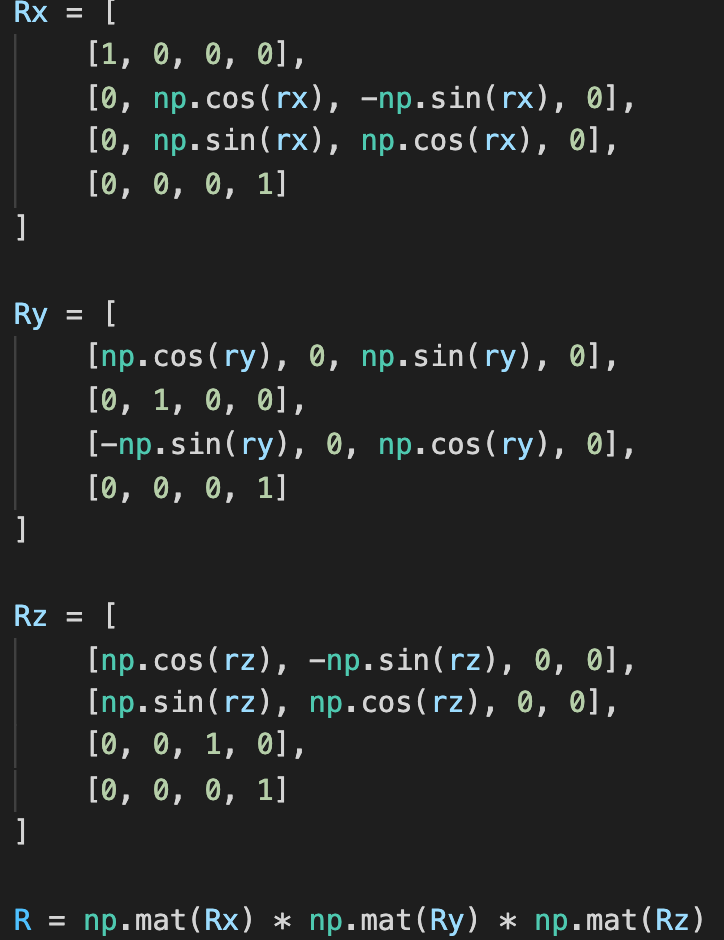   

三、综合来看，某个点在三维世界里的平移旋转可以拆分为这样一个过程：该3D点先进行旋转操作，再进行平移操作(这里说的旋转，指的是绕原点的旋转，所以并不能做先平移再旋转的操作，旋转分量会改变)。如果将平移矩阵记做T，将旋转矩阵记做R，则这个过程可以表示为：

	P2 = T * R * P1
	T * R的结果就是我们日常所说的外部参数
	
##点云融合原理
自动驾驶点云采集设备：

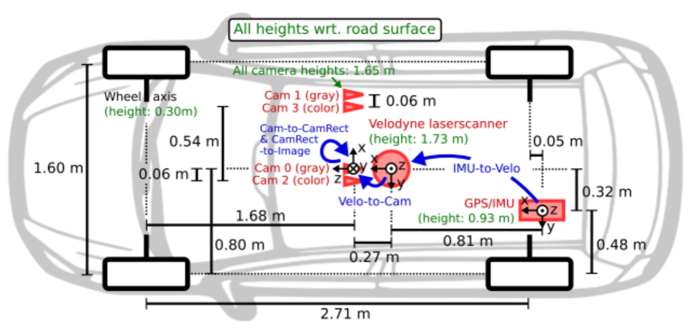
原理基本：

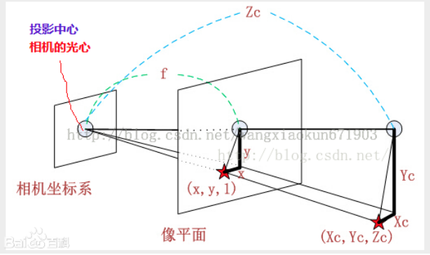

点云融合(投影)，基本原理是将3D世界坐标系下的点投影到2D图片上，具体拆分为以下几个步骤：  
a)因为雷达和相机在物理摆放的时候不能做到位置上和方向上的精确重叠，所以要将雷达采集到的数据做一个平移旋转(刚体)变换，这个用于描述冲雷达到相机坐标系的变换的矩阵称作外部参数，外部参数描述了相机将以何种方式去看雷达采集到的3D点，也体现了相机和雷达之间的相对位置关系。具体推到原理在上一节已经说明。  
b)相机看到的3D点通过镜头由小孔成像原理投影到图片上。这个小孔成像的变化过程，也可以由一个矩阵表明，这个矩阵是由相机本身决定的，相机的焦距，成像的图片尺寸等等均会影响这个变化过程。具体可以百度"张氏标定法"，里面详细介绍了这个过程。

[张氏标定法](https://www.cnblogs.com/wangguchangqing/p/8335131.html)

>这里提到的小孔成像的变换矩阵即是内部参数

K矩阵之和相机自身的特性相关

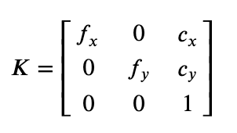  
fx，fy 表示将相机的焦距𝑓变换为在x,y方向上像素度量表示；cx, cy 表示成像光心坐标点，和成像图像大小有关系。  

c)由于相机的制造工艺不能完全符合理论值的预期，所以投影到图片上的点会发生偏移，为了修正这个问题，引入了畸变参数，来将投影点修正到理论范围内。畸变参数同样是由相机本身决定的，在计算内参的时候一般会附带给出。去除畸变的实质就是对像素点坐标做加加减减的线性计算。

##总结：

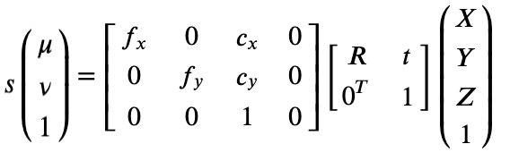

##点云融合实例代码讲解
1.云融合示例  
2.3D框投影示例    